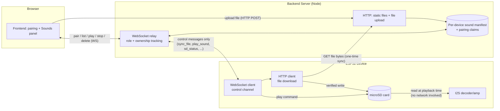
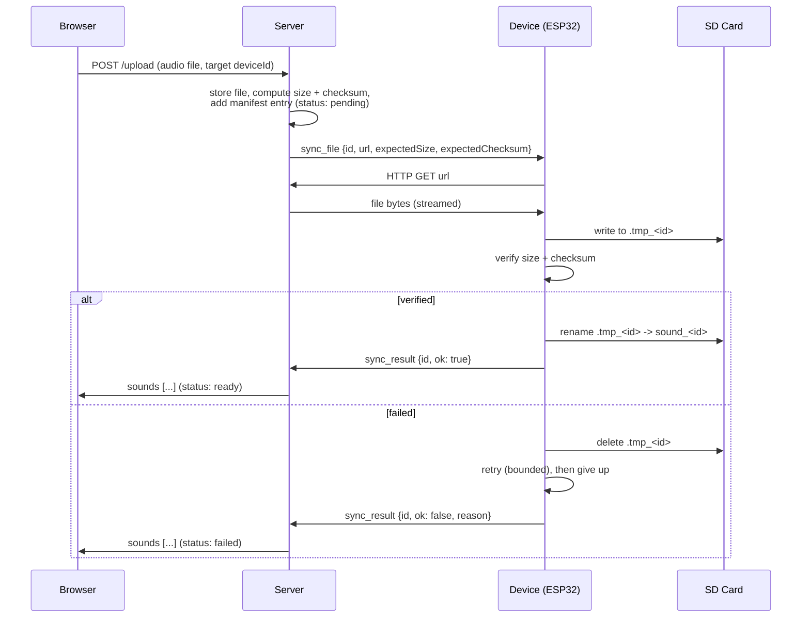
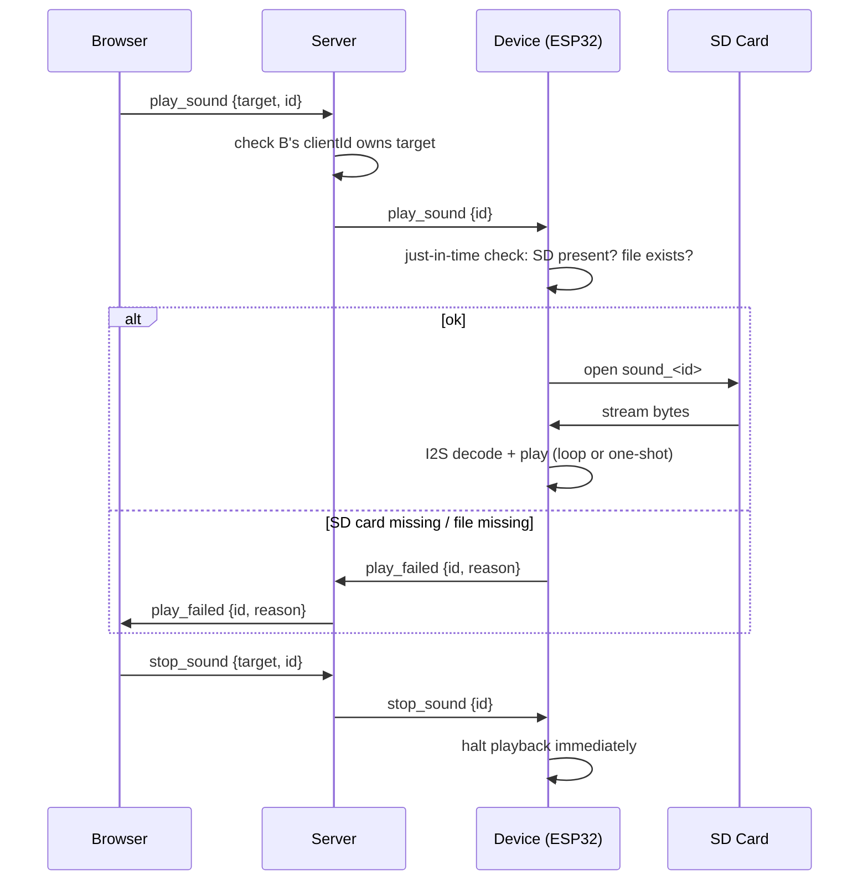

# Audio Alarm — Design Document

Extends the LED demo (`led-demo/`) into a WiFi-connected alarm device: each ESP32 stores its own library of sounds on a local SD card and plays them on command, loud enough to cover a house. This document captures the architecture, components, and full data flow agreed on before implementation starts. Nothing here is built yet — see [Status](#status) at the bottom.

## Goals / constraints that shaped this design

- **Playback must not depend on the network at the moment it matters.** Uploading a sound can be slow/retried; playing an already-synced sound must work even if WiFi is degraded at that instant.
- **Each device has its own independent sound library** — not a shared/global one. Device A's sounds have nothing to do with Device B's.
- **The device is the source of truth for what's physically on its SD card.** The server's records are a cache of what the device last reported, never an assumption.
- **Loud enough to cover multiple rooms from one unit** — drives the audio output hardware choice (amp + speaker), independent of everything else in this document.

## Components

### Hardware (per device)

| Component | Role | Notes |
|---|---|---|
| ESP32 devkit | Runs firmware, WiFi, control logic | Already in use (LED demo board) |
| I2S DAC/amp (e.g. MAX98357A) | Converts digital audio to analog for the speaker | Existing `ESP32-audioI2S`-family library handles I2S output |
| Speaker (+ optional separate Class-D amp for higher volume) | Actual sound output | Sizing is a separate decision (see prior hardware-tier discussion); everything below is agnostic to which tier is chosen |
| microSD card module (SPI) + microSD card | Local, persistent sound storage | Few dollars of hardware; GBs of space, far more than needed for audio clips |
| BOOT button | Long-press (10s) Wi-Fi reset | Already implemented |

### Software

| Component | Role |
|---|---|
| **ESP32 firmware** (Arduino) | WiFiManager onboarding, mDNS server discovery, WebSocket control client, SD card read/write, HTTP client for downloading synced files, I2S playback, integrity verification, SD/file status reporting |
| **Backend server** (Node/Express/ws) | Serves frontend, WebSocket relay with device/browser role + ownership tracking, file upload endpoint, per-device sound manifest store, mDNS advertisement |
| **Frontend** (browser) | Device pairing UI, per-device Sounds panel (upload / list / play / stop / delete), live status display (syncing / ready / missing / no SD card) |

Everything under "already implemented" reuses the pairing/targeting system built for the LED demo — this is an extension of that protocol, not a separate system.

## Architecture

The WebSocket is **only ever a control channel** — small JSON messages, same as the existing `flash`/`reset_wifi` commands. The actual audio bytes move over a plain HTTP GET the device makes to the server, once, during sync — never during playback.

## Message protocol (extends the existing `hello` / `flash` / `reset_wifi` set)

| Direction | Message | Purpose |
|---|---|---|
| Browser → Server | `upload` (HTTP POST, not WS) | Add a new sound to a specific device's library |
| Server → Device | `sync_file {id, url, expectedSize, expectedChecksum}` | "Download and verify this, save it as `id`" |
| Device → Server | `sync_result {id, ok, reason?}` | Reports whether the download+verify succeeded |
| Device → Server | `sd_status {present}` | Pushed whenever SD card presence changes (boot, periodic check, or detected removal) |
| Device → Server | `sd_report {present, files: [{id, size}]}` | Full reconciliation of what's *actually* on the card — sent on boot and after any sync/delete |
| Browser → Server → Device | `play_sound {target, id}` | Play a specific sound on a specific device |
| Browser → Server → Device | `stop_sound {target, id}` | Stop playback immediately |
| Browser → Server → Device | `delete_sound {target, id}` | Remove a sound from the device's library |
| Device → Server → Browser | `play_failed {id, reason: "no_sd_card"\|"file_missing"}` | Reported if a just-in-time check fails at play time |
| Server → Browser | `sounds {devicdId, sounds: [{id, name, status}]}` | Current library + status for a device the browser has paired |

Every `sync_file` / `play_sound` / `stop_sound` / `delete_sound` is subject to the same ownership check already built for `flash`/`reset_wifi`: the server only relays it if the requesting browser's `clientId` has paired that `deviceId`.

## Flow 1 — Device setup & first sound (extends existing pairing)

1. Fresh device boots → no saved Wi-Fi → `LED-Demo-Setup` portal shows the Device ID → user configures home Wi-Fi (**existing**).
2. Device connects, resolves server via mDNS, WebSocket-connects, sends `hello` with its `deviceId` (**existing**).
3. User pairs the device in the browser by pasting its ID (**existing**).
4. **New**: setup isn't considered complete until at least one sound has been uploaded and verified (Flow 2) — no separate hardcoded fallback tone needed, since the onboarding flow itself guarantees a real sound exists before the device is "done."

## Flow 2 — Uploading and syncing a sound

The temp-name-then-atomic-rename pattern means a half-downloaded or corrupted file can never be mistaken for a valid one, even across a power loss mid-download.

## Flow 3 — Playing / stopping a sound

No network round-trip happens during the actual audio read — only the initial `play_sound` control message and, if something's wrong, the `play_failed` report.

## Flow 4 — Keeping SD/file status honest in real time

Because physical media can change at any moment (card pulled, file deleted from a computer), the device — never the server's assumptions — drives this:

- **On boot**: mount the card (or fail → `present: false`), scan what's really there, send a full `sd_report`.
- **Periodically** (~30-60s): cheap presence re-check; push `sd_status` immediately if it changed since last report — don't wait to be asked.
- **At play time**: one more just-in-time check (Flow 3), since "fine 30 seconds ago" isn't the same as "fine right now."

The server treats every `sd_report`/`sd_status` as authoritative and overwrites its own manifest accordingly — including marking a sound "missing" even if the server's last record said "ready," if the device's report disagrees.

## Failure modes and how each is handled

| Failure | Handling |
|---|---|
| Download corrupted/truncated | Temp file + size/checksum verification + atomic rename (Flow 2) |
| SD card physically removed | Device-pushed `sd_status`, checked again just before playback |
| File deleted outside the system (e.g. via a computer) | Caught by boot-time/periodic `sd_report` reconciliation |
| Device offline when browser requests playback | Server can't deliver `play_sound` at all — must tell the browser "device offline" immediately, not queue it silently |
| Wrong browser tries to control a device it hasn't paired | Rejected by the existing ownership check, extended to all new message types |
| WiFi degraded during sync (not during playback) | Not time-critical — retry is acceptable, unlike a live-streaming design would require |

## Status

**Largely implemented** — see [`../README.md`](../README.md) (Milestone 6 and the "Sounds: upload, storage, and playback" section) for the actual, current protocol and setup steps. One deliberate deviation from this document plus what's still open:

- **Storage medium: SPI NOR flash chip (W25Q64JV), not an SD card.** Same rationale (local persistent storage, device is the source of truth), same FAT-filesystem approach, same temp-file-then-atomic-rename sync pattern — just different physical hardware than originally sketched here. The message protocol below (`sync_file`, `sync_result`, `play_sound`, etc.) is otherwise implemented close to as designed, with `sd_report`/`sd_status` renamed to `fs_report` to match.
- **Not yet implemented**: periodic (~30-60s) background presence/status re-check (Flow 4) — currently only reports on WebSocket (re)connect and after each sync/delete. Mid-playback `stop_sound` also doesn't interrupt an already-blocking playback loop yet (see README's Notes section).
- Loop vs. one-shot playback behavior, and whether that's per-sound or global — still open.
- Whether volume is fixed or adjustable from the frontend — still open.
- Final hardware tier for audio output (loudness vs. cost/effort) — resolved in practice: a MAX98357A I2S amp + small speaker, wired and working.
